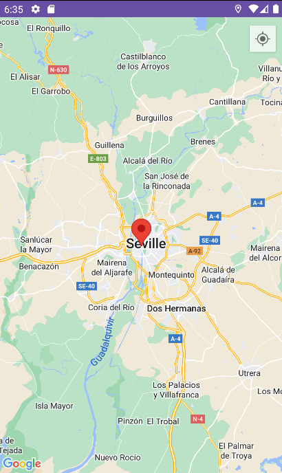
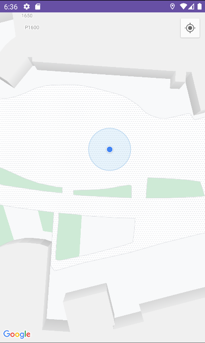

# App Real Time Location with Google Maps

* [Google Maps](https://developers.google.com/maps?hl=es-419)

## On the main page, we can see a map with the location of Seville that is zoomed in

 

## We also have an icon above that will take us to our real location, once we accept the permissions

 
